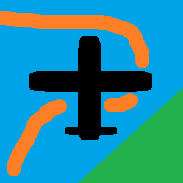

# Gliss

A new Flutter project. that is aimed at helping glider pilots nalyze their flights. It will be used
as a flight logbook as well.

## Building

You might want to start by setting up a flutter dev environment. It builds like a normal flutter app.
